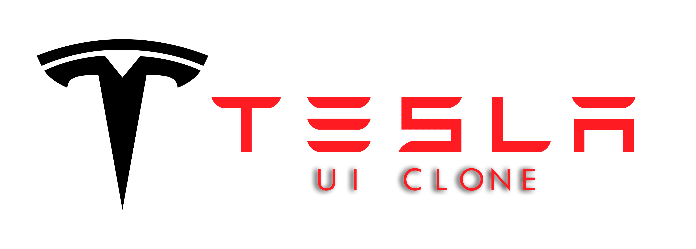

## ui-clone-tesla

<div align="center">
	
</div>

<br>

<div align="center">

  <!-- HTML -->
  <a href="https://www.w3schools.com/tags/tag_doctype.asp" target="_blank">
    
  </a>

  <!-- CSS -->
  <a href="https://devdocs.io/css/" target="_blank">
    
  </a>

  <!-- TypeScript -->
  <a href="https://www.typescriptlang.org/" target="_blank">
    
  </a>

  <!-- Node.Js
  <a href="https://nodejs.org/en/" target="_blank">
    
  </a> -->

  <!-- ReactJS -->
  <a href="https://nodejs.org/en/" target="_blank">
    
  </a>

  <!-- SQLite
  <a href="https://www.sqlite.org/docs.html" target="_blank">
    
  </a> -->

  <!-- RocketSeat -->
  <a href="https://rocketseat.com.br" target="_blank">
    
  </a>

</div>

<h3 align=center>

UI Clone é uma prática usada para recriar diversas homepages famosas. Nessa aplicação utilizamos as tecnologias **TypeScript** e **React.js**.

</h3>

<h1 align=center>
  
</h1>

## 🚀 Introdução 

<p align=justify> 
  No Ui Clone #14 recriamos juntamente com o Instrutor Guilherme Rodz uma das homepages mais famosas, sim ela mesma, lhes apresento o UI da <a href="https://www.tesla.com/"><b>Tesla</b></a> .
</p>

<br>

## 👨🏽‍💻 Aplicação Deployed

Clique aqui para acessar a minha aplicação: **[ui-clone-tesla](https://ui-clone-tesla.raionenascimento.com.br/)**.

<br>

### 📑 **Web** - ***TypeScript e React.js***

  - **[React.js](https://pt-br.reactjs.org/)**
  - **[TypeScript](https://www.typescriptlang.org/)**

  - **[React-Router-DOM](https://reactrouter.com/web/guides/quick-start)**
  - **[Styled-Components](https://styled-components.com/)**

<br>

### 🧰  **Utilitários**

  - Editor: **[Visual Studio Code](https://code.visualstudio.com/download)** 
  - Fontes: **[Roboto](https://fonts.google.com/specimen/Roboto)**

<br>

### ***Configurações Iniciais***

Primeiro, você precisa ter o [NodeJS](https://nodejs.org/en/download/) instalado na sua máquina. 

Se você estiver utilizando o **Linux** ou **MacOS**, você pode optar por instalar o **Node** através do gerênciador de versões através do [link](https://nodejs.org/en/download/package-manager/) para facilitar o processo de mudança da versão do **Node**, quando for necessário.

Você pode optar também por utilizar o **yarn** no lugar do **npm**. Você pode instalar clicando nesse [yarn](https://yarnpkg.com/), ou através do [link](https://classic.yarnpkg.com/pt-BR/docs/install/#debian-stable).

Instale as dependências contidas nos arquivos `package.json` que se encontram na raíz do repositório (para o gerenciamento de commits), no diretório do **server** e no diretório do **website**. Para instalar as dependências, basta abrir o terminal no diretório e digitar o comando:

<br>

### ***Instalando Dependencias***
```sh
$ cd /ui-clone-tesla e depois execute o comando:
$ npm install

# ou

$ yarn install
```
<br>

### ***Iniciando a aplicação Web***

```sh
# Executando a aplicação web:
$ yarn start ou npm start
```
<br>

## 🙏 Considerações finais

Fica aqui o agradecimento ao Diego Fernandes e Mayk Brito por sempre disponibilizar materiais de qualidade da rocketseat e nos mostrar que ***o aprendizado é contínuo e sempre haverá um próximo nível***.

<div align="center">

  <table style="width:100%">
    <tr align="center">
      <!-- <th><strong>Rocketseat</strong></th> -->
      <th><strong>Guilherme Rodz | Rocketseat</strong></th>
    </tr>
    <tr align="center">
      <!-- <td>
        <a href="https://rocketseat.com.br/">
          
        </a>
      </td> -->
      <td>
        <a href="https://github.com/guilhermerodz">
          
        </a>
      </td>
    </tr>
  </table>

</div>

<p align=center>
  <strong>Instrutor:</strong>
  <a href="https://github.com/diego3g" target="_blank">Guilherme Rodz</a>
</p>

<p align=center>
  <b>Gostou do projeto?</b> Me ajude deixando uma estrela para me insentivar ainda mais nos estudos 🤓
</p>

`made with 💜 by raionedeveloper © 2020`
